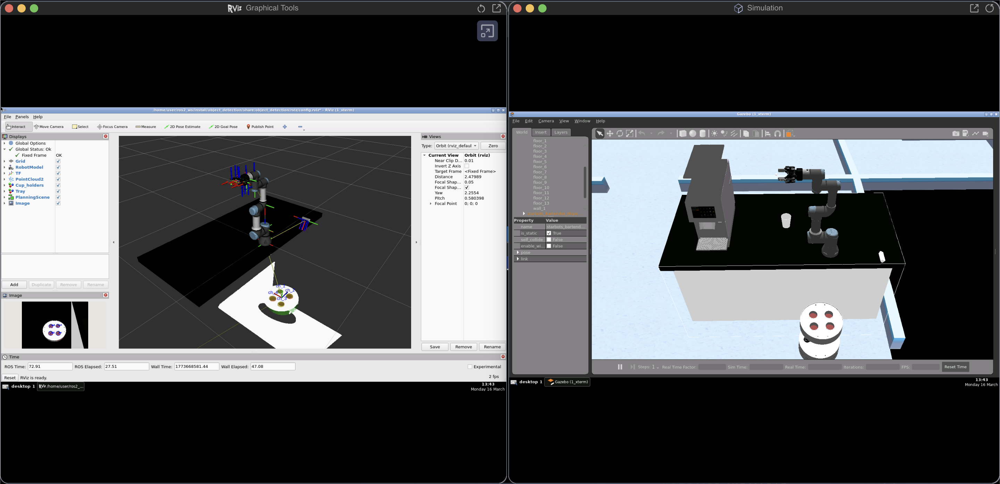

# Starbots Coffee Cup Dispenser

Simulation branch for my Robotics Developer Masterclass final project.

This repo is focused on the **simulation pipeline** (UR3e + Barista world), with:

- MoveIt2 planning config (`OMPL` + `PILZ`)
- perception node for hole/object detection
- BehaviorTree-based manipulation logic
- action interface to trigger cup delivery



## What is inside this repo

- `my_moveit_config` -> robot planning and controller config
- `object_detection` -> perception node (`Python`)
- `object_manipulation` -> planning/execution node (`C++`, BT-based)
- `custom_msgs` -> project messages and actions (`DeliverCup.action`)
- `media` -> screenshots for documentation

## Quick Run (after workspace is already built)

Terminal 1:

```bash
source ~/ros2_ws/install/setup.bash
ros2 launch the_construct_office_gazebo starbots_ur3e.launch.xml
```

Terminal 2:

```bash
source ~/ros2_ws/install/setup.bash
ros2 launch object_manipulation deliver_cup.launch.py
```

Terminal 3 (send a request):

```bash
source ~/ros2_ws/install/setup.bash
ros2 action send_goal /deliver_cup custom_msgs/action/DeliverCup "{cupholder_id: 1}" --feedback
```

## Docker reproducibility (Ubuntu server)

This repository includes a dockerized runtime at `docker/`, adapted to this project.
The Docker image recipe is `docker/starbots-ros2-manipulation`.

From the project root:

```bash
cd ~/ros2_ws/src/starbots_coffee_dispenser/docker
chmod +x ros_entrypoint.sh
docker compose build
docker compose up
```

What this container launches:

- `ros2 launch object_manipulation deliver_cup.launch.py`
- `ros2 launch rosbridge_server rosbridge_websocket_launch.xml port:=9090`

Foxglove connection:

- same machine: `ws://localhost:9090`
- remote server: `ws://<SERVER_IP>:9090`
- The Construct public tunnel case: use the URL returned by `rosbridge_address`

Important note:

- This container expects the cafeteria simulation to already be running in the same ROS domain.
- Start simulation on host (outside container) before sending goals:

```bash
source ~/ros2_ws/install/setup.bash
ros2 launch the_construct_office_gazebo starbots_ur3e.launch.xml
```

Layout import (in Foxglove):

- `/home/user/ros2_ws/src/starbots_coffee_dispenser/foxglove_webapp/foxglove_webapp.json`

## One-time Setup (host machine)

Target platform:

- Ubuntu 22.04
- ROS 2 Humble
- workspace at `~/ros2_ws`

### 1) Base packages

```bash
source /opt/ros/humble/setup.bash
sudo apt update
sudo apt install -y git cmake build-essential libzmq3-dev libsqlite3-dev
sudo apt install -y python3-pcl
```

### 2) Build and install BehaviorTree.CPP 4.6.2 locally

```bash
git clone https://github.com/BehaviorTree/BehaviorTree.CPP.git
cd BehaviorTree.CPP
git checkout 4.6.2

cmake -S . -B build \
  -DCMAKE_BUILD_TYPE=Release \
  -DBTCPP_BUILD_TOOLS=ON \
  -DCMAKE_INSTALL_PREFIX=$HOME/.local

cmake --build build -j"$(nproc)"
cmake --install build

find $HOME/.local -name 'behaviortree_cppConfig.cmake'
```

### 3) Initialize rosdep (only first time on machine)

```bash
sudo rosdep init
rosdep update
```

### 4) Build this workspace

```bash
cd ~/ros2_ws
source /opt/ros/humble/setup.bash
source ~/.local/share/behaviortree_cpp/local_setup.bash

colcon build --symlink-install \
  --cmake-args -Dbehaviortree_cpp_DIR=$HOME/.local/share/behaviortree_cpp/cmake

source install/setup.bash
```

## Simulation bring-up checks

After launching `starbots_ur3e.launch.xml`, validate these two points.

### A) Controllers are active

```bash
ros2 control list_controllers
```

Expected:

```text
joint_trajectory_controller[joint_trajectory_controller/JointTrajectoryController] active
joint_state_broadcaster[joint_state_broadcaster/JointStateBroadcaster] active
gripper_controller  [position_controllers/GripperActionController] active
```

### B) Joint states are streaming

```bash
ros2 topic echo /joint_states
```

If startup fails once, stop and relaunch the simulation. In this project that is occasionally normal.

## Camera / perception check

```bash
ros2 topic list | grep -E "depth|camera|point"
```

This is useful before sending `/deliver_cup` goals.

## Real robot note (Zenoh)

This repository is simulation-first, but for real robot camera visualization you can use:

```bash
cd ~/ros2_ws/src/zenoh-pointcloud/
./install_zenoh.sh

cd ~/ros2_ws/src/zenoh-pointcloud/init
./rosject.sh

ros2 topic list
```

## Troubleshooting notes

- `deliver_cup` does nothing:
  - confirm controllers are `active`
  - confirm `/joint_states` is publishing
  - relaunch `object_manipulation deliver_cup.launch.py`
- simulation starts but behaves unstable:
  - wait until Gazebo fully spawns both robots before sending action goals
- first Gazebo launch fails:
  - relaunch once; this is a known intermittent behavior
