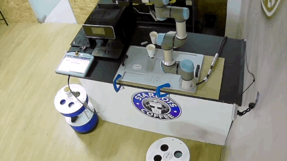
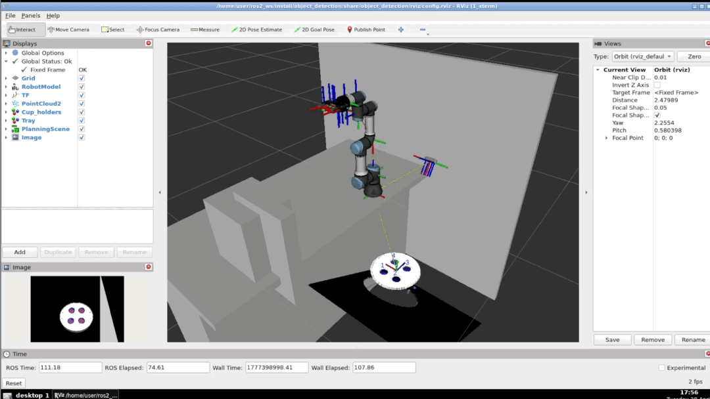
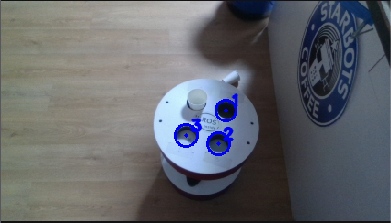

# Starbots Coffee Cup Dispenser

**Robotics Developer Masterclass - Final Project**

A ROS 2 Humble project that uses a real UR3e robotic arm with a Robotiq 85 gripper to autonomously detect cup holders on a barista robot, pick up coffee cups, and deliver them to a specified holder. The system integrates computer vision, motion planning, and a behavior tree-based task executor, all monitored through a Foxglove web interface.



## Table of Contents

- [System Architecture](#system-architecture)
- [Packages Overview](#packages-overview)
  - [object\_detection](#object_detection---perception-pipeline)
  - [object\_manipulation](#object_manipulation---task-execution)
  - [my\_moveit\_config](#my_moveit_config---motion-planning)
  - [custom\_msgs](#custom_msgs---interface-definitions)
- [Perception System](#perception-system)
- [Manipulation System](#manipulation-system)
- [Web Interface (Foxglove)](#web-interface-foxglove)
- [Custom ROS 2 Interfaces](#custom-ros-2-interfaces)
- [Setup](#setup)
- [Usage](#usage)
- [Troubleshooting](#troubleshooting)

## System Architecture

```
                        ┌──────────────────────┐
                        │   RealSense D415     │
                        │   Depth Camera       │
                        └────┬─────┬─────┬─────┘
                             │     │     │
                           Color Depth PointCloud
                             │     │     │
                    ┌────────▼─────▼─────▼─────────┐
                    │   object_detection (Python)  │
                    │ ┌──────────────────────────┐ │
                    │ │ CupholderPerception      │ │
                    │ │ (contour + Hough circle) │ │
                    │ ├──────────────────────────┤ │
                    │ │ StableTracker            │ │
                    │ │ (EMA smoothing + NN)     │ │
                    │ └──────────────────────────┘ │
                    └─────────────┬────────────────┘
                                  │
                        /cup_holder_detected
                                  │
┌──────────────┐   ┌──────────────▼────────────────┐
│  Foxglove    │   │  object_manipulation (C++)    │
│  Web UI      │   │ ┌───────────────────────────┐ │
│              │   │ │ BehaviorTree.CPP 4.6.2    │ │
│ - 3D view    │   │ │                           │ │
│ - Order btn  │◄──┤ │ ValidateDetection         │ │
│ - Camera     │   │ │ PrePick ─► Pick           │ │
│ - Status     │   │ │ PrePlace ─► Place         │ │
│ - Logs       │   │ │ PutBack (recovery)        │ │
│              │   │ │ Return (home)             │ │
└──────────────┘   │ └────────────┬──────────────┘ │
                   └──────────────┼────────────────┘
                                  │
                      ┌───────────▼────────────┐
                      │  MoveIt 2 Move Group   │
                      │ (OMPL + PILZ planners) │
                      └────────────┬───────────┘
                                   │
                      ┌────────────▼───────────┐
                      │  UR3e Real Robot       │
                      │  (Starbots Cafeteria)  │
                      └────────────────────────┘
```



## Packages Overview

```
starbots_coffee_dispenser/
├── object_detection/        # Perception pipeline (Python)
├── object_manipulation/     # Task execution with BehaviorTree (C++)
├── my_moveit_config/        # MoveIt 2 config for UR3e + Robotiq 85
├── custom_msgs/             # ROS 2 message, service, and action definitions
├── foxglove_webapp.json     # Foxglove Studio layout for web monitoring
└── media/                   # Screenshots for documentation
```

### `object_detection` - Perception Pipeline

An `ament_python` package that processes RGB-D camera data to detect and track cup holders on the barista robot's tray.

**Nodes:**

| Node | Description |
|------|-------------|
| `object_detection` | Main perception node: detects empty cup holders and publishes 3D positions |
| `pcl_qos_conv` | QoS bridge that converts best-effort PointCloud2 messages to reliable QoS |

**Key modules:**

- `perception_core.py` - Cup holder detection using contour analysis with Hough Circle fallback
- `tracker.py` - Multi-object tracker with EMA smoothing and nearest-neighbor matching
- `geometry.py` - 3D point projection from depth images to robot-frame coordinates
- `object_detection.py` - Main ROS 2 node wiring perception, tracking, and TF transforms

### `object_manipulation` - Task Execution

A `CMake` C++ package that orchestrates the full pick-and-place pipeline using BehaviorTree.CPP 4.6.2 and MoveIt 2.

**Executables:**

| Executable | Description |
|------------|-------------|
| `object_manipulation` | BehaviorTree executor + MoveIt 2 motion interface |
| `deliver_cup_bridge` | Wraps the `/deliver_cup` action as a ROS 2 service for Foxglove integration |
| `add_cafeteria_scene` | Adds collision objects (tray, platform) to the MoveIt planning scene |

**BehaviorTree nodes** (8 total):

| Node | Type | Role |
|------|------|------|
| `GoalNotCanceled` | Condition | Checks if the delivery goal is still active |
| `ValidateDetection` | Action | Confirms the target cup holder has a valid detection |
| `PrePick` | Action | Moves to a pre-grasp pose above the cup |
| `Pick` | Action | Closes the gripper to grasp the cup |
| `PrePlace` | Action | Moves to a pre-place pose above the target holder |
| `Place` | Action | Opens the gripper to release the cup |
| `PutBack` | Action | Recovery: returns the cup to its original position |
| `Return` | Action | Returns the arm to the home configuration |

### `my_moveit_config` - Motion Planning

Generated with MoveIt Setup Assistant and customized for the UR3e + Robotiq 85 + D415 camera setup.

**Planning groups:**

| Group | Description |
|-------|-------------|
| `ur_manipulator` | 6-DOF arm chain: `base_link` to `tool0` |
| `gripper` | Robotiq 85 parallel gripper (9 joints) |

**Named poses:** `home`, `flex`, `open`, `close`

**Planners:** OMPL (default, sampling-based) and PILZ (deterministic industrial)

**IK solver:** LMA Kinematics Plugin (0.1s timeout, 0.005 rad resolution, 20 attempts)

### `custom_msgs` - Interface Definitions

Defines all project-specific ROS 2 interfaces used for inter-node communication.

## Perception System

The perception pipeline runs as a single ROS 2 node that subscribes to the D415 depth camera and publishes stable, filtered cup holder detections in the robot's `base_link` frame.

### Detection Algorithm

1. **Preprocessing** - CLAHE contrast enhancement + adaptive thresholding + morphological open/close
2. **Circle detection** - Primary: contour-based (circularity threshold 0.58). Fallback: Hough Circle transform
3. **3D projection** - Detected circles are projected to 3D using depth data and camera intrinsics
4. **Frame transform** - Positions are transformed from camera optical frame to `base_link` via TF2

### Multi-Object Tracking

Each detection is tracked across frames by a `StableTracker`:

- **Association:** Greedy nearest-neighbor matching (4-6cm threshold)
- **Smoothing:** Exponential Moving Average on position (alpha 0.30-0.45)
- **Confirmation:** A track must persist for 3-7 consecutive frames before it is published
- **Garbage collection:** Tracks with 6-20 missed frames are removed

### Empty-Only Detection

The perception pipeline publishes only empty cup holders. Candidates that look like cup tops or flat surfaces are rejected via a depth-step check between the hole center and the surrounding ring. Any detection reaching `/cup_holder_detected` is a valid target for cup placement.



### Published Topics

| Topic | Type | Description |
|-------|------|-------------|
| `/cup_holder_detected` | `custom_msgs/DetectedObjects` | Confirmed cup holder positions (3D, in `base_link`) |
| `/cup_holder_markers` | `visualization_msgs/MarkerArray` | RViz/Foxglove visualization markers |
| `/barista_cam_annotated` | `sensor_msgs/Image` | Annotated RGB image with detection overlays |

## Manipulation System

The manipulation node uses a BehaviorTree to sequence the pick-and-place pipeline. The tree is defined in `deliver_cup_tree.xml` and executed by BehaviorTree.CPP 4.6.2.

### Behavior Tree Structure

```
DeliverCupRoot (ReactiveSequence)
├── GoalNotCanceled                    ← checked on every tick
└── MainSequence
    ├── CoffeeDelivery
    │   ├── ValidateDetection
    │   ├── PrePick
    │   ├── Pick
    │   └── PlaceOrRecover (Fallback)
    │       ├── TrytoPlace
    │       │   ├── PrePlace
    │       │   └── Place
    │       ├── Inverter → PutBack     ← recovery: return cup
    │       └── Return                 ← last resort: go home
    └── Return
```

The `ReactiveSequence` at the root ensures the tree halts immediately if the goal is canceled. The `Fallback` node in `PlaceOrRecover` provides graceful degradation: if placing the cup fails, it attempts to put it back; if that also fails, it returns the arm home.

<!--  -->

### Motion Parameters

| Parameter | Value | Description |
|-----------|-------|-------------|
| Pre-grasp Z offset | 0.25 m | Height above object for approach |
| Approach Z delta | 0.10 m | Descent from pre-grasp to grasp |
| Place retry Z step | 0.005 m | Incremental height adjustment on place retry |
| Velocity scaling | 10% | Safe operating speed |
| Goal position tolerance | 0.5 mm | End-effector accuracy |
| Goal orientation tolerance | 0.05 rad | Wrist angle tolerance |

### Action Server

The main command interface is the `/deliver_cup` action, which accepts a target `cupholder_id` and reports progress through feedback messages. A service bridge (`deliver_cup_bridge`) also exposes the same functionality as a synchronous `/deliver_cup` service for use from the Foxglove web interface.

## Web Interface (Foxglove)

The project uses [Foxglove Studio](https://foxglove.dev/) as its web-based monitoring and control interface. The layout is defined in `foxglove_webapp.json` and includes:

| Panel | Description |
|-------|-------------|
| **3D Visualization** | Robot model, point clouds, cup holder markers, TF frames |
| **Order Coffee** | Service call button to trigger `/deliver_cup` with a target holder ID |
| **Robot Status** | Live feedback from `/robot_status_feedback` |
| **Barista Tray Detections** | Annotated camera stream from `/barista_cam_annotated` |
| **ROS Logs** | Filtered `/rosout` log viewer |
| **State Transitions** | Timeline of robot status and BehaviorTree node transitions |

### Loading the layout

1. Open Foxglove Studio (web or desktop)
2. Connect to the robot via `rosbridge` or `foxglove_bridge`
3. Import `foxglove_webapp.json` from the **Layout** menu


## Custom ROS 2 Interfaces

### Action: `DeliverCup`

Main command interface for triggering a cup delivery.

```
# Goal
uint32 cupholder_id          # Target cup holder (1-4)
---
# Result
bool success                 # True if cup delivered successfully
string message               # Status or error description
---
# Feedback
string stage                 # Current execution phase
float32 progress             # 0.0 to 1.0
uint32 cupholder_id          # Active target holder
```

### Message: `DetectedObjects`

Per-holder detection output from the perception node.

```
uint32 object_id                  # Unique tracked ID
geometry_msgs/Point position      # 3D position in base_link frame
float32 height                    # Holder dimension
float32 width                     # Holder dimension
float32 thickness                 # Rim thickness
```

### Message: `DetectedSurfaces`

Detected plane/surface (tray).

```
uint32 surface_id
geometry_msgs/Point position
float32 height
float32 width
```

### Service: `PickPlaceCup`

Synchronous wrapper used by the Foxglove service call panel.

```
# Request
uint8 goal_cup_holder
---
# Response
string result
```

## Setup

### Prerequisites

- Ubuntu 22.04 LTS
- ROS 2 Humble
- Python 3.10+
- UR3e robot arm with Robotiq 85 gripper
- Intel RealSense D415 depth camera
- Zenoh (for camera data streaming)

### 1. Install system dependencies

```bash
source /opt/ros/humble/setup.bash
sudo apt update
sudo apt install -y git cmake build-essential libzmq3-dev libsqlite3-dev python3-pcl
```

### 2. Build BehaviorTree.CPP 4.6.2

The manipulation package depends on BehaviorTree.CPP 4.6.2, which must be built from source:

```bash
git clone https://github.com/BehaviorTree/BehaviorTree.CPP.git
cd BehaviorTree.CPP
git checkout 4.6.2

cmake -S . -B build \
  -DCMAKE_BUILD_TYPE=Release \
  -DBTCPP_BUILD_TOOLS=ON \
  -DCMAKE_INSTALL_PREFIX=$HOME/.local

cmake --build build -j"$(nproc)"
cmake --install build
```

Verify:

```bash
find $HOME/.local -name 'behaviortree_cppConfig.cmake'
```

### 3. Initialize rosdep (first time only)

```bash
sudo rosdep init
rosdep update
```

### 4. Build the workspace

Clone this repository into your ROS 2 workspace `src/` directory, then:

```bash
cd ~/ros2_ws
source /opt/ros/humble/setup.bash
source ~/.local/share/behaviortree_cpp/local_setup.bash

colcon build --symlink-install \
  --cmake-args -Dbehaviortree_cpp_DIR=$HOME/.local/share/behaviortree_cpp/cmake

source install/setup.bash
```

## Usage

### 1. Connect to the real robot and set up Zenoh

After connecting to the UR3e robot, install and start Zenoh for camera data streaming:

```bash
cd ~/ros2_ws/src/zenoh-pointcloud/
./install_zenoh.sh

cd ~/ros2_ws/src/zenoh-pointcloud/init
./rosject.sh
```

Verify camera topics are available:

```bash
ros2 topic list | grep D415
```

### 2. Verify robot controllers

Confirm that the robot controllers are active:

```bash
ros2 control list_controllers
```

Expected:

```
joint_trajectory_controller[joint_trajectory_controller/JointTrajectoryController] active
joint_state_broadcaster[joint_state_broadcaster/JointStateBroadcaster] active
gripper_controller  [position_controllers/GripperActionController] active
```

Confirm joint states are streaming:

```bash
ros2 topic echo /joint_states --once
```

### 3. Launch the manipulation pipeline

```bash
source ~/ros2_ws/install/setup.bash
ros2 launch object_manipulation deliver_cup.launch.py
```

This single launch file starts all required nodes:

- Object detection (perception)
- PointCloud QoS converter
- MoveIt Move Group
- Collision scene setup
- RViz visualization
- BehaviorTree manipulation node (5s delayed start)
- Deliver cup service bridge

### 4. Send a delivery command

In another terminal:

```bash
source ~/ros2_ws/install/setup.bash
ros2 action send_goal /deliver_cup custom_msgs/action/DeliverCup "{cupholder_id: 1}" --feedback
```

Or use the Foxglove web interface to press **Order Coffee** with the desired holder ID.

## Troubleshooting

| Problem | Solution |
|---------|----------|
| `/deliver_cup` does nothing | Verify controllers are `active` with `ros2 control list_controllers`, check `/joint_states` is publishing, relaunch the manipulation launch file |
| No camera topics | Ensure Zenoh is running, then check that `/D415/color/image_raw` and depth topics exist with `ros2 topic list` |
| Detection not publishing | Verify PointCloud QoS converter is running and `/D415/barista_points` has data |
| Robot not responding | Check the robot is powered on and the controller box is connected; verify with `ros2 topic echo /joint_states --once` |
